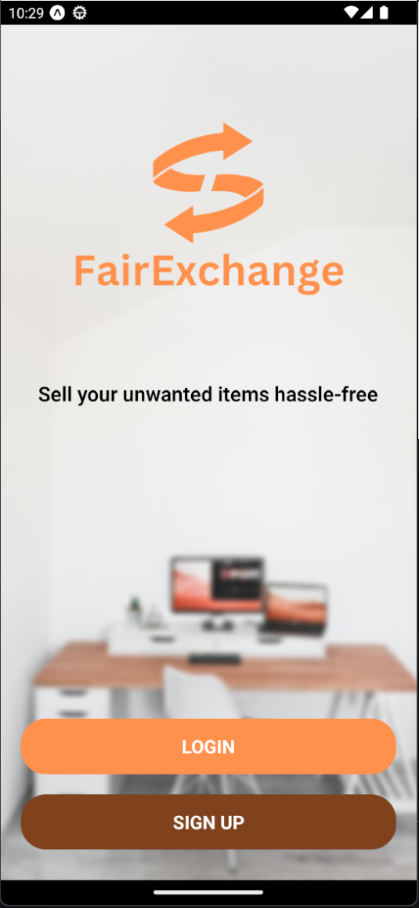
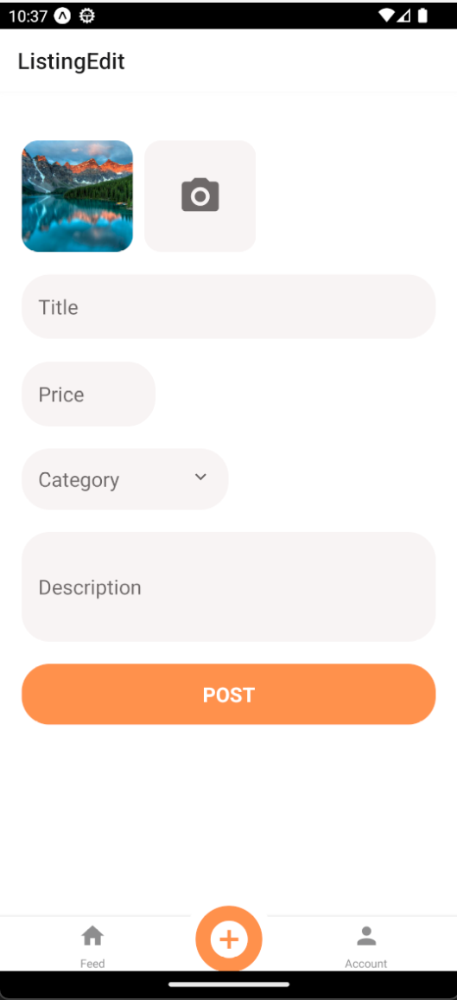
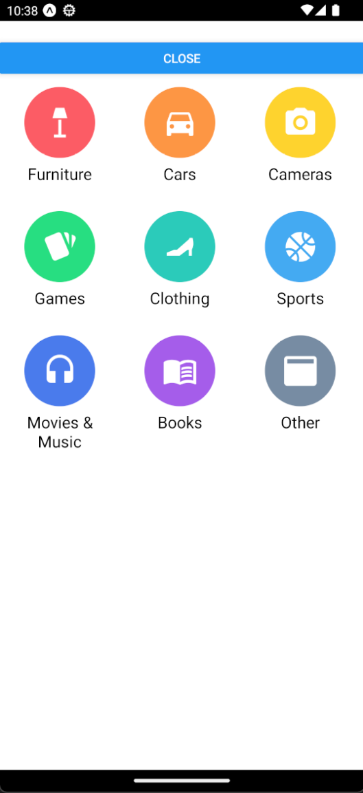
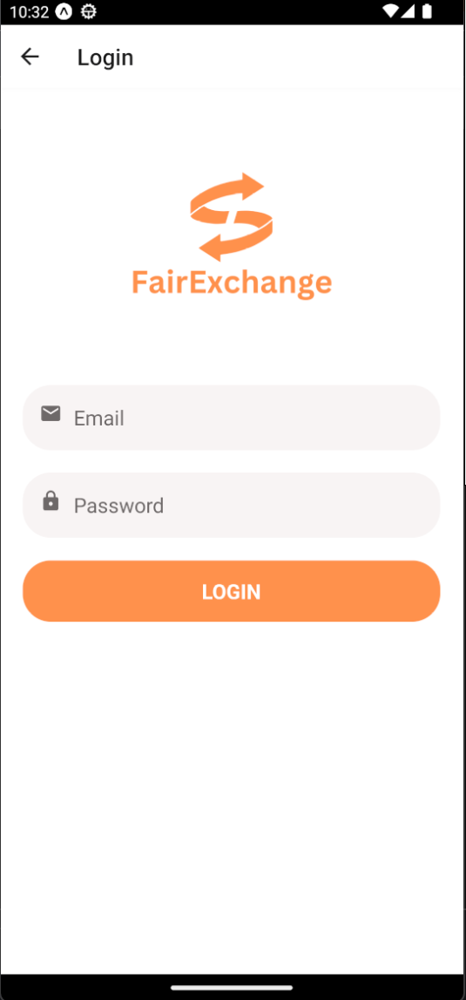
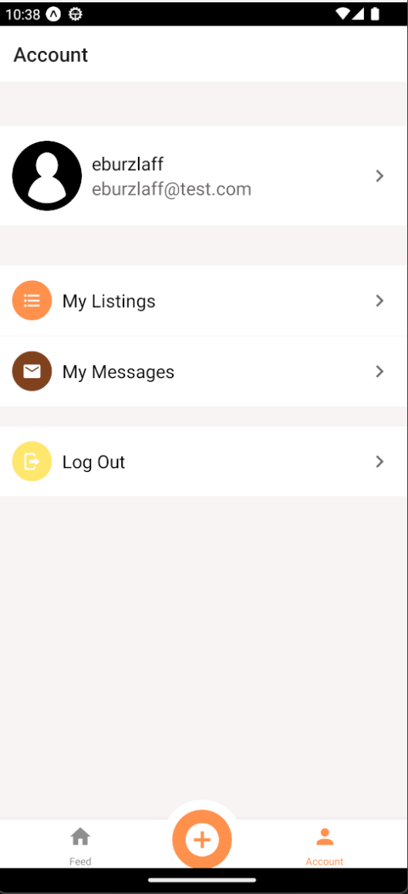
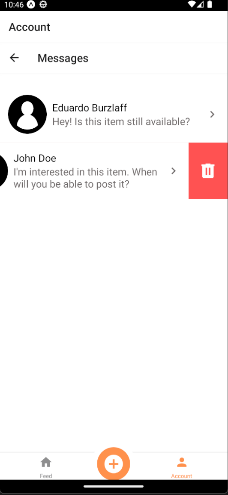

# Fair Exchange App

# Description
React Native Expo-Managed Marketplace App where users can sell things they don't want anymore.

## Youtube Demo link:
[soon]()

## Technologies
- React Native/ Expo

## Screenshots

  
  
  
  
  
  
  
  
  

## Setup
- download or clone the repository
- install the expo cli
- run `npm install`
- run `npm start`
